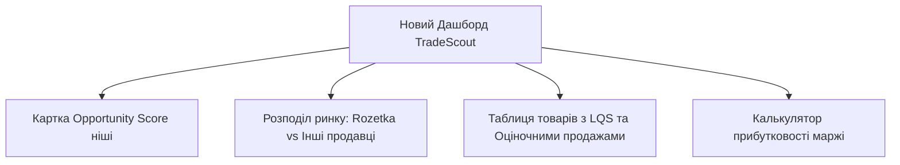

# Аналіз конкурентів та концепція розвитку TradeScout

Щоб підняти платформу TradeScout до рівня професійних інструментів аналітики (таких як **Jungle Scout** та **Helium 10** для Amazon), нам потрібно впровадити ключові метрики та інструменти, які використовують провідні селлери у світі.

Нижче наведено детальний аналіз функціонала конкурентів та план їх адаптації для українського маркетплейса **Rozetka**.

---

## 1. Аналіз ключових метрик конкурентів (Amazon)

### A. Jungle Scout
*   **Opportunity Score (Оцінка можливості ніші):** Оцінка від 1 до 10, яка розраховується автоматично для пошукового запиту чи категорії. 
    *   *Формула:* Співвідношення високого попиту (багато продажів/відгуків) та низької конкуренції (мало сильних брендів, низька якість лістингів конкурентів).
*   **LQS (Listing Quality Score - Оцінка якості лістингу):** Оцінка від 1 до 10 для окремого товару.
    *   *Критерії:* Довжина заголовка, кількість та якість зображень, наявність детальних характеристик, рейтинг товару (>4.5) та кількість відгуків.

### B. Helium 10
*   **Success Score (Індекс успіху):** Схожий на Opportunity Score, але більше орієнтований на обсяги пошукових запитів (Search Volume) та швидкість продажів (Sales Velocity).
*   **Sales Rank & Review Velocity (Швидкість продажів та росту відгуків):** Динаміка того, як швидко товар накопичує нові відгуки та продажі за останні 30 днів.

---

## 2. Адаптація метрик для Rozetka (TradeScout)

Для професійного аналізу Rozetka ми впровадимо три головні метрики, адаптовані під специфіку українського ринку:

### 📊 1. Оцінка якості картки (LQS - Listing Quality Score)
Кожен товар отримує індивідуальну оцінку від **1 до 10** на основі наступних критеріїв:
*   **Рейтинг (> 4.5):** +2 бали
*   **Кількість відгуків (> 20):** +2 бали
*   **Наявність детальних характеристик (specs):** +2 бали
*   **Наявність ШІ-вердикту (пройдено аудит):** +2 бали
*   **Статус наявності (В наявності):** +2 бали

*Якщо середній LQS товарів у ніші низький (наприклад, 4-5), це сигналізує про слабких конкурентів — чудова можливість зайти зі своїм якісним товаром!*

### 📈 2. Швидкість накопичення відгуків (Review Velocity)
Оскільки Rozetka не показує точну кількість продажів, ми вираховуємо **Review Velocity** та оцінюємо продажі:
*   **Прогнозовані продажі на місяць:** На основі світової та локальної статистики e-commerce, відгуки залишають приблизно **5-7% покупців**.
*   *Формула прогнозу:* `Estimated Monthly Sales = (Reviews Growth за 30 днів) * 15`. 
*   Це дасть селлеру орієнтовну кількість продажів конкурента!

### 🎯 3. Оцінка ніші (Niche Opportunity Score)
Загальний бал ніші від **1 до 10** на основі агрегованих даних:
*   **Попит (Demand):** Розраховується через сумарну кількість відгуків та їхній ріст.
*   **Конкуренція (Competition):** Визначається кількістю унікальних продавців та часткою самої Rozetka (якщо Rozetka сама продає 80% товарів у ніші, конкурувати дуже важко).
*   **Потенціал покращення:** Середній LQS конкурентів (чим він нижчий, тим вища оцінка ніші).

---

## 3. План покращення інтерфейсу (Dashboard)

Для професійного вигляду ми додамо нові елементи аналітики на головний екран:

### 🆕 Нові аналітичні блоки на дашборді:
1. **Market Share (Частка ринку):** Кругова діаграма розподілу брендів та продавців (дозволяє побачити монополію).
2. **Margin Calculator (Калькулятор селлера):** Зручна панель, де користувач вводить ціну закупівлі (COGS), вартість доставки та комісію Розетки, а система вираховує чистий прибуток (Net Profit) та маржинальність (ROI).
4. **Світлофорна колірна індикація (LQS):** Зелений (чудовий лістинг), жовтий (середній), червоний (потребує покращення).

---

## 4. План реалізації

### Крок 1: Оновлення серверної моделі (`server.ts`)
* Додати автоматичний розрахунок LQS для кожного товару при імпорті.
* Реалізувати розрахунок `Estimated Monthly Sales` та загального `Opportunity Score` ніші.

### Крок 2: Оновлення фронтенду Angular (`dashboard.html` / `dashboard.ts`)
* Додати стовпчики **LQS** та **Прогнозовані продажі** в таблиці.
* Інтегрувати кругову діаграму розподілу продавців (наприклад, через Chart.js або CSS Grid).
* Додати форму калькулятора маржі.

---

> [!NOTE]  
> Цей план перетворить TradeScout з простого скрейпера на потужний професійний інструмент аналізу ринку e-commerce, який не поступається Helium 10!
